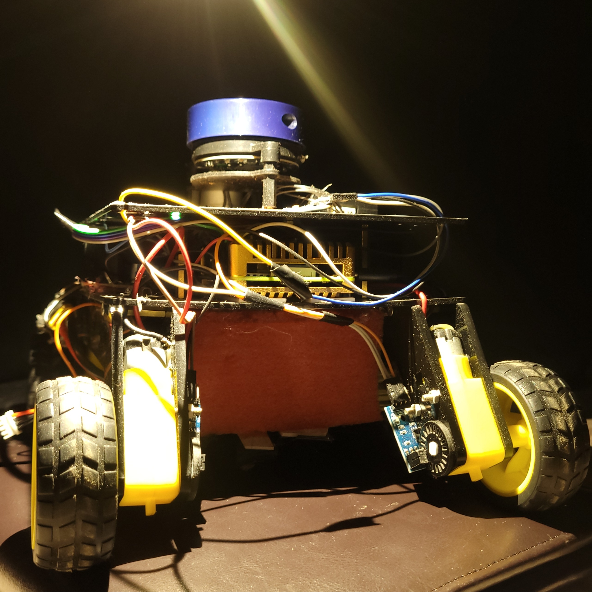
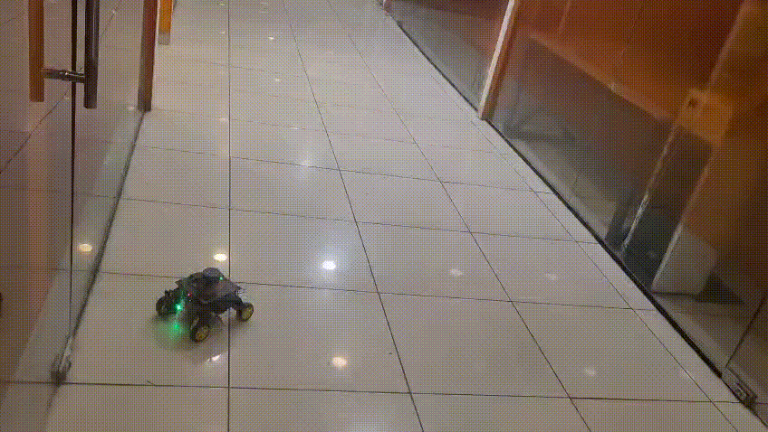
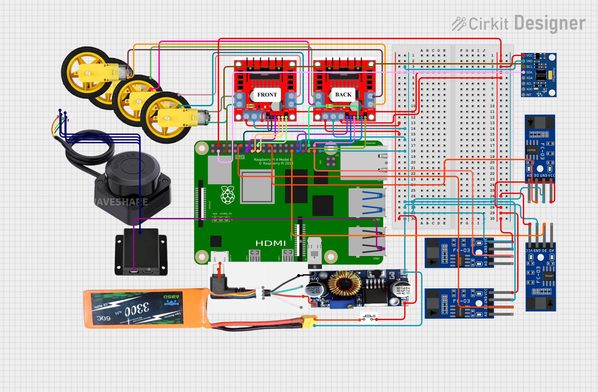
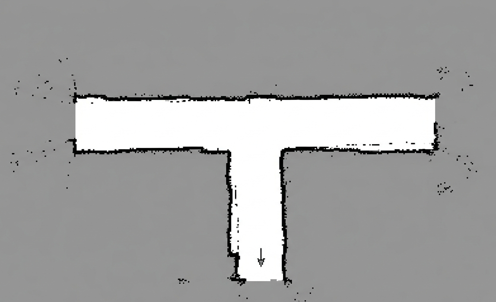
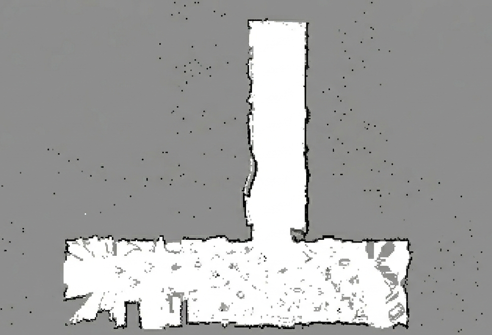

# NAMI – Navigational Autonomous Mapping Intelligence

**LiDAR-based Autonomous Robot for Indoor Navigation and Logistics Automation**

[](https://docs.ros.org/en/humble/)
[](https://www.python.org/)
[](https://creativecommons.org/licenses/by-nc/4.0/)
[](https://www.raspberrypi.org/)

<p align="center">
  
</p>

> **Major Academic Project (2025–2026)**  
> B.Tech Computer Science & Engineering (Artificial Intelligence)  
> Dr. APJ Abdul Kalam University, India

---

## 📖 Overview

Many indoor environments such as offices, hospitals, and warehouses still rely on manual transportation of files, supplies, and materials. This consumes valuable time and diverts staff from their core responsibilities.

**NAMI addresses this challenge** by introducing an autonomous navigation system that can map unknown indoor environments, localize itself, plan optimal routes, and avoid obstacles—all without requiring external infrastructure such as magnetic tracks or fiducial markers.

The system demonstrates that robust autonomous navigation can be achieved using **classical SLAM algorithms on affordable hardware**, making logistics automation accessible for educational institutions and small-scale deployments.

### Key Goals

- ✅ **Infrastructure-free navigation** – No magnetic tracks, QR codes, or pre-installed markers
- ✅ **Autonomous environment mapping** – Builds maps while exploring unknown spaces
- ✅ **Real-time obstacle avoidance** – Safely navigates around static and dynamic obstacles
- ✅ **Reliable operation** – Maintains consistent performance in dynamic environments

---

## 🎥 Demo

<p align="center">
  
</p>

> NAMI autonomously mapping and navigating through an office corridor environment

---

## ✨ Features

- 🗺️ **SLAM-based Mapping** – Simultaneous Localization and Mapping for real-time map generation
- 📡 **360° LiDAR Scanning** – Complete environmental perception with YDLIDAR X2
- 🧭 **Intelligent Path Planning** – A* algorithm for optimal route calculation
- 🚧 **Dynamic Obstacle Avoidance** – Real-time detection and route adjustment
- 🤖 **Autonomous Navigation** – Point-to-point navigation without human intervention
- 💻 **Embedded Processing** – Runs on Raspberry Pi 4 without GPU acceleration
- 🔋 **Extended Operation** – 5+ hours continuous runtime on battery

---

## 🏗️ System Architecture

### Hardware Components

<p align="center">
  
</p>

| Component | Model/Type | Specifications |
|-----------|------------|----------------|
| **Processor** | Raspberry Pi 4B | Quad-core ARM Cortex-A72 @ 1.5GHz, 4GB RAM |
| **LiDAR Sensor** | YDLIDAR X2 | 360° coverage, 8-12m range, 0.45° resolution, 6-7Hz scan rate |
| **IMU** | MPU-6050 | 6-axis (accelerometer + gyroscope), 100Hz, DMP fusion |
| **Wheel Encoders** | Optical coupling | 100 pulses/revolution, 5mm resolution |
| **Motors** | DC Brushed Gearmotor | 125 RPM @ 12V, dual-shaft configuration (4 motors) |
| **Motor Driver** | L298N H-Bridge | Dual channel, 2A per channel |
| **Battery** | 3S LiPo | 11.1V, 5200mAh, 57.72Wh capacity |
| **Chassis** | Differential Drive | 35cm × 30cm × 20cm, 5cm ground clearance |

### Software Stack

```
┌─────────────────────────────────────────────┐
│          ROS Humble (Ubuntu 20.04)          │
├─────────────────────────────────────────────┤
│  Navigation & Planning                      │
│  ├─ SLAM Toolbox (mapping & localization)   │
│  ├─ A* Global Planner (path planning)       │
│  └─ DWA Local Planner (obstacle avoidance)  │
├─────────────────────────────────────────────┤
│  Sensor Processing                          │
│  ├─ ydlidar_ros_driver (LiDAR)              │
│  ├─ encoder_odom.py (wheel odometry)        │
│  └─ mpu6050_driver (IMU fusion)             │
├─────────────────────────────────────────────┤
│  Motor Control & Actuation                  │
│  └─ motor_bridge.py (L298N control)         │
└─────────────────────────────────────────────┘
```

---

## ⚙️ How It Works

### 1. Environment Scanning
The **YDLIDAR X2 sensor** continuously scans 360° around the robot, generating approximately 800 distance measurements per rotation at 6-7Hz frequency.

### 2. Simultaneous Localization and Mapping (SLAM)
- **Graph-based SLAM** fuses LiDAR scans with wheel odometry and IMU data
- Builds a **2D occupancy grid map** (5cm resolution)
- Maintains robot **pose estimate** within the map
- **Loop closure detection** corrects accumulated drift

### 3. Path Planning
- **Global planner** uses **A* algorithm** to compute optimal paths through the occupancy grid
- Considers obstacles, clearance, and distance to goal
- Updates routes when new obstacles are detected

### 4. Obstacle Avoidance
- **Dynamic Window Approach (DWA)** evaluates velocity commands over short time horizons
- **Real-time reaction** to moving obstacles (pedestrians, furniture)
- Maintains safety margins around obstacles

### 5. Motor Control & Execution
- Translates velocity commands to differential wheel speeds
- **PWM control** via L298N motor drivers
- Continuous feedback from encoders for accurate motion

---

## 📊 Generated Maps

<p align="center">
  
  
</p>

**Left:** Office corridor T-shaped environment  
**Right:** Multi-room layout with furniture

> Maps generated using SLAM Toolbox. Black = obstacles, White = free space, Gray = unexplored

---

## 🎯 Applications

NAMI can be deployed in environments requiring indoor transport automation:

### 🏥 Healthcare Facilities
- Transporting lab samples between departments
- Medicine delivery to nursing stations
- Document and file distribution

### 🏢 Corporate Offices
- Internal mail and document distribution
- Supply delivery to workstations
- Cafeteria service automation

### 📦 Warehouses & Logistics
- Inventory movement between zones
- Order picking assistance
- Material transport to packing stations

### 🏨 Hospitality Industry
- Room service delivery
- Luggage transportation
- Linen and supply distribution

---

## 🛠️ Installation

### Prerequisites

**Hardware Requirements:**
- Raspberry Pi 4B (2GB RAM minimum)
- 16GB+ microSD card
- All components from hardware table above

**Software Requirements:**
- Ubuntu 20.04 LTS (Raspberry Pi)
- ROS Humble
- Python 3.8+

### Manual Component Startup

**⚠️ Start in this order:**

1. **Encoder Odometry** (MUST START FIRST)
```bash
python3 encoder_odom.py
# Wait for "Encoder odom ready"
```

2. **LiDAR Driver**
```bash
ros2 launch ydlidar_ros2_driver ydlidar_launch.py
```

3. **SLAM System**
```bash
ros2 launch slam_toolbox online_async_launch.py \
    params_file:=$HOME/mapper_params_online_async.yaml
```

4. **Motor Control**
```bash
python3 motor_bridge.py
```

5. **Explore Stack**
```bash
python3 explore.py
```

---

## 🔬 Research & Development

### Current Capabilities
✅ Real-time 2D SLAM on Raspberry Pi 4  
✅ Multi-sensor fusion (LiDAR + IMU + Encoders)  
✅ Autonomous navigation in structured environments  
✅ Dynamic obstacle avoidance  

### Future Enhancements
- [ ] **3D Obstacle Detection** – Add depth camera (Intel RealSense)
- [ ] **Semantic Mapping** – Object recognition and classification
- [ ] **Multi-Robot Coordination** – Fleet management system
- [ ] **Predictive Obstacle Avoidance** – ML-based trajectory prediction
- [ ] **Voice Commands** – Natural language navigation interface
- [ ] **Elevator Navigation** – Multi-floor operation capability
- [ ] **Battery Management** – Auto-return to charging station

---

## 📚 Documentation

- [📄 Research Paper](assets/IJRPR63151.pdf)

---

## 🤝 Contributing

Contributions are welcome! This project is maintained as an educational resource.

**How to contribute:**
1. Fork the repository
2. Create a feature branch (`git checkout -b feature/improvement`)
3. Commit changes (`git commit -m 'Add improvement'`)
4. Push to branch (`git push origin feature/improvement`)
5. Open a Pull Request

**Areas for contribution:**
- Improved calibration algorithms
- Additional sensor drivers (ultrasonic integration)
- Enhanced navigation behaviors
- Documentation improvements
- Bug fixes and optimization

---

## 📄 License

This project is licensed under the **Creative Commons Attribution–NonCommercial 4.0 International License (CC BY-NC 4.0)**.

**You are free to:**
- ✅ Share and adapt the material
- ✅ Use for research or educational purposes

**Under these conditions:**
- 📝 Proper attribution must be given to the original authors
- 🚫 **Material may not be used for commercial purposes**

Full license text: https://creativecommons.org/licenses/by-nc/4.0/

---

## 👥 Authors

**Vivek Prakash**  
Department of Computer Science & Engineering (Artificial Intelligence)  
Dr APJ Abdul Kalam University, India

**Major Academic Project (2025–2026)**

---

## 📞 Contact
 
**Issues & Questions:** [GitHub Issues](https://github.com/IkkiOcean/NAMI/issues)

**Email:** [vivekprakashindia@gmail.com](mailto:vivekprakashindia@gmail.com)

---

## ⭐ Acknowledgments

- ROS community for excellent middleware and tools
- SLAM Toolbox developers for robust graph-based SLAM
- Open-source robotics community for inspiration and resources
- YD-lidar for their documention and maintainance

---

## 📊 Project Status

🟢 **Active Development** – Currently maintained and accepting contributions

**Last Updated:** May 2026  
**Version:** 1.0.0  
**ROS Distribution:** Humble 
**Target Platform:** Raspberry Pi 4B

---

<p align="center">
  <strong>⭐ If you find this project useful, please consider giving it a star! ⭐</strong>
</p>

<p align="center">
  <sub>Built with ❤️ for autonomous robotics research and education</sub>
</p>
